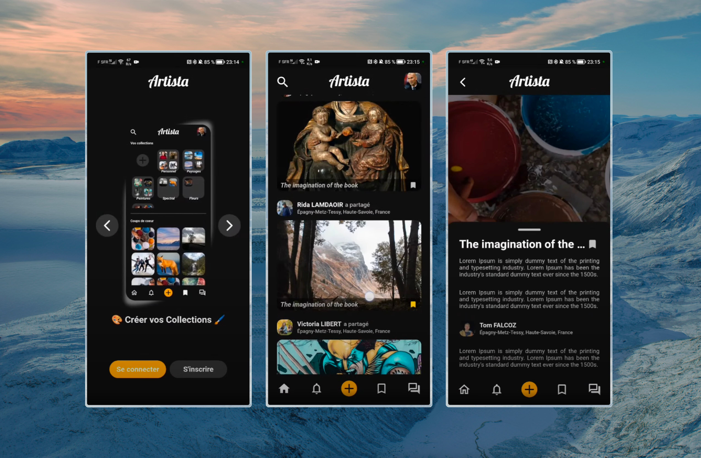

<div align='center'>

  [](.)
  
  # Artista Project

  It's a mobile application for grouping various artists, built with [Flutter](https://flutter.dev).

  [](https://flutter.dev)

  [](https://dart.dev) 
  [](https://www.apple.com/fr/swift)

  [Contributors](#-contributors) • [Description](#-description) • [How To Use](#-how-to-use) • [Key Features](#-key-features) • [Credits](#-credits) • [Support](#-support) • [License](#-license)

  

</div>

<div>
    
  ## 👨‍🎓 Contributors

  

  ## 📚 Description

  The project consists of the creation of a new mobile application specialised for artists where they can post their works, demonstrations, exhibitions, etc. Indeed, the objective of this new social network is to popularise art among the largest number of people. The aim is also to highlight all types of art, because when we think of this word, we often think of a picture, a painting, so it is visual art. But it is not the only one, there is also auditory art with music, jingles; and also audiovisual art with more "immersive" experiences. Different roles will be set up for this social network: User, Artist and Administrator.

  ## 🚀 How To Use

  To clone and run this application, you'll need [Git](https://git-scm.com) (which comes with [npm](https://www.npmjs.com)) installed on your computer. From your command line:

  ```bash
  # Clone this repository
  $ git clone https://github.com/thomaspsl/artista-app

  # Go into the repository
  $ cd artista-app
  
  # Install dependencies
  $ flutter pub get
  
  # Run the app
  $ flutter run lib/main.dart
  ```

  ## 🔑 Key Features

  You can find the specifications for this project [here](https://docs.google.com/document/d/1-9So_Khd03XDREVyta-hP0RD6P2HC9zX/edit?usp=sharing&ouid=111340274041187141616&rtpof=true&sd=true).

  ## ✨ Credits

  [](https://www.patreon.com)
  [](https://www.patreon.com)

  ## 💸 Support

  [](https://www.patreon.com)
  [](https://www.paypal.com)

  ## 🔒 License

  MIT

</div>

<div align='center'>
  
  Instagram [@thomaspssl](https://www.instagram.com/thomaspssl) • GitHub [@thomaspsl](https://github.com/thomaspsl) • Twitter [@thomaspssl](https://twitter.com/thomaspssl)
  
</div>
